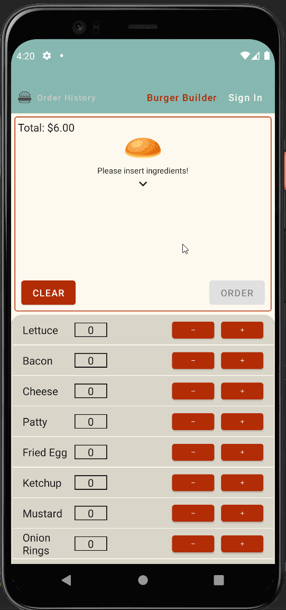

# BurgerBuilder for Android

**BurgerBuilder** is an android app that allows building a burger and ordering for delivery. It stores ordering history per user account.

## User Stories

The following **required** functionality is completed:

* [x] User can **conscruct custom burger**
* [x] User can **sign in and enter contact details with validation**
* [x] User's **orders are saved in order history** upon successful completion of orering

The app was built entirely with Jetpack Compose.

## Video Walkthrough

GIF created with [LiceCap](http://www.cockos.com/licecap/).
